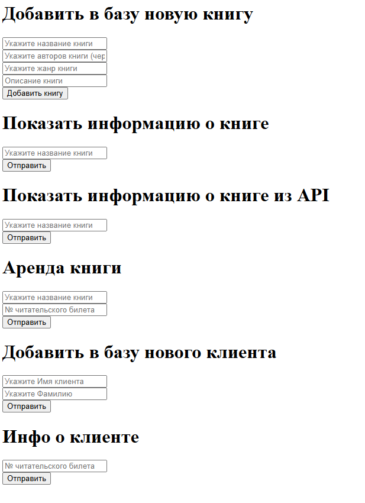
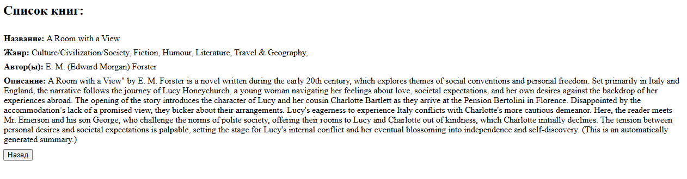
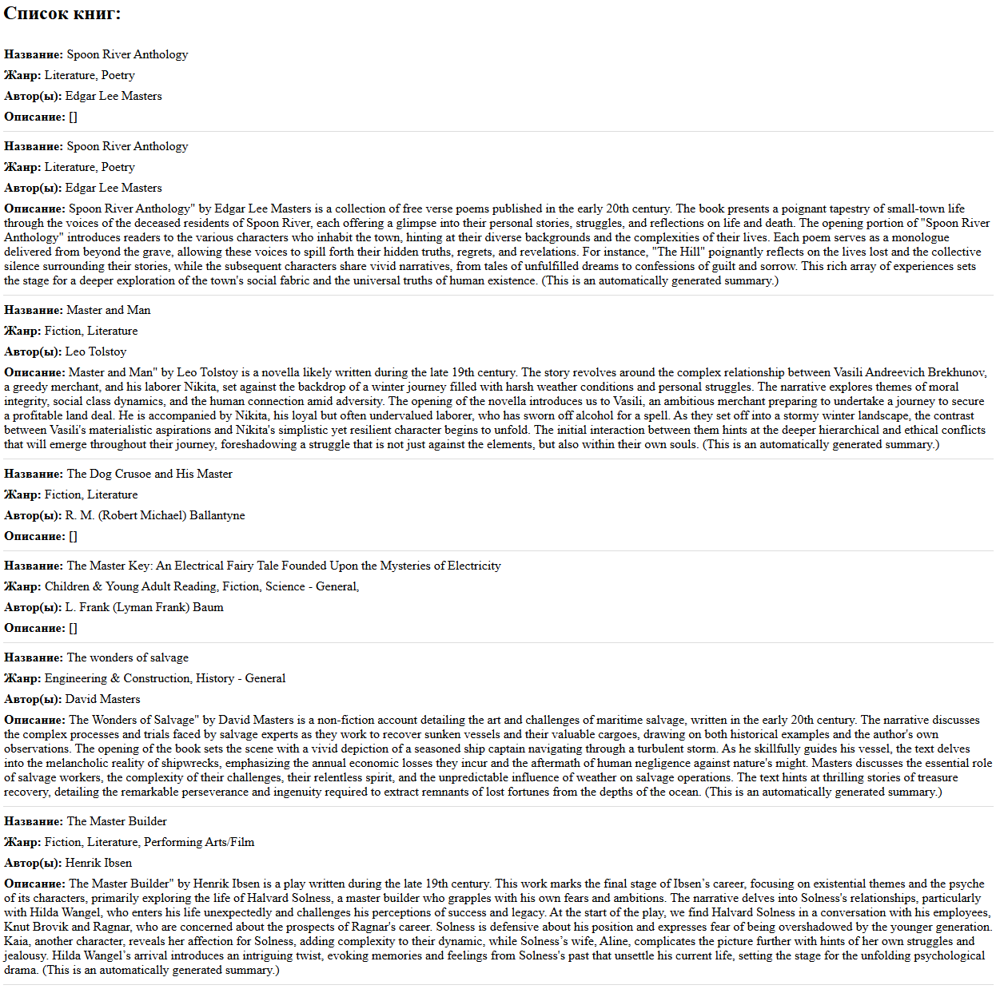
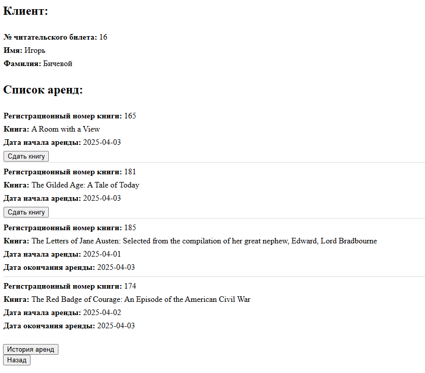

### Задание: Система управления библиотекой

#### Цели проекта:

1. Разработать систему управления библиотекой, которая позволяет пользователям арендовать и возвращать книги.
2. Интегрировать функциональность поиска книг в открытом API для получения информации о новых книгах.
   (`postgresql` + `JDBC`)

#### Основные требования:

##### Часть 1: Базовая функциональность

1. Создание базы данных:
    - Создайте базу данных с таблицами для хранения информации о книгах, пользователях, аренде и возвращении книг.
    - Проектируйте схемы с учетом нормализации и целостности данных.

2. Функциональность аренды и возврата:
    - Реализуйте серверный компонент, позволяющий пользователям арендовать книги из библиотеки.
    - Обеспечьте возможность регистрации и управления пользователями, включая историю аренд.
    - Добавьте возможность возврата арендованных книг, обновляя соответствующее состояние в базе данных.

##### Часть 2: Интеграция с Web API для поиска книг

1. Поиск новых книг:
    - Реализуйте функцию, которая позволяет искать информацию о новых книгах через внешнее API (например, Google Books
      API).
    - При введении запроса пользователем сервер должен отправить HTTP-запрос к API для получения информации о книге.

2. Обработка ответов API:
    - Сервер должен обрабатывать и сохранять важную информацию о найденных книгах (например, название, автора и
      описание).
    - Информация может быть сохранена в дополнительной таблице или обновлять информацию о имеющихся книгах.

3. Расширенное управление данными:
    - Создайте возможность обновления базы данных на основе информации, полученной из внешних API.
    - Разработайте интерфейс для представления новых записей и их автоматической интеграции в систему.

#### Дополнительные задачи (опционально):

- Реализуйте подробную систему отчетности по аренде и возврату книг.
- Добавьте функциональность для отслеживания задолженности по возврату книг и уведомления пользователей.
- Разработайте возможности группировки и фильтрации книг по различным параметрам (жанр, автор, популярность).
- Интегрируйте механизм регулярного обновления информации о книгах из внешнего API.
- (Поправьте описание, если что-то забыл сделать из того, что было в прошлой версии библиотеки)

#### Рекомендации:

- Обратите внимание на обработку транзакций и исключений при взаимодействии с базой данных.
- Изучите подходы к обработке и хранению данных, полученных из внешних API.
- Обеспечьте безопасность данных, включая управление доступом и защиту от SQL-инъекций.

Результат:
- Структура БД  

- Главная страница  

- Локальный список книг по точному совпадению 

- Список книг из внешнего API, ищет по вхождению  

- Карточка клиента
