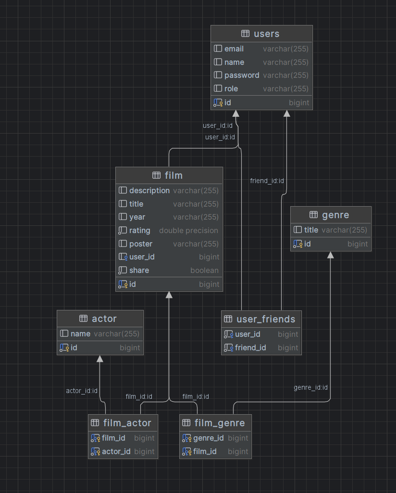

### Веб-приложение для создания и управления списком просмотренных фильмов

#### Общая информация:

Цель проекта — создать веб-приложение, в котором пользователи могут создавать и управлять списками просмотренных
фильмов. Для удобства и информативности приложение будет интегрировано с внешним сервисом, таким как IMDb или
аналогичным, для получения информации о фильмах.

#### Основные функции:

1. Управление личными списками фильмов:
    - Возможность создания, редактирования и удаления списка просмотренных фильмов.
    - Добавление фильмов в список с возможностью указания даты просмотра и личной оценки.

2. Интеграция с API IMDb или аналогичным:
    - Возможность поиска фильмов через стороннее API и добавления их в список.
    - Получение информации о фильме: постер, год выпуска, жанр, актёры и краткое описание.
    - * кеширование результатов в REDIS

3. Просмотр и фильтрация списков:
    - Отображение списка просмотренных фильмов с возможностью фильтрации по жанрам, дате просмотра и личной оценке.
    - Функциональность сортировки по разным критериям (дата добавления, дата просмотра, оценка и т.д.).

4. Социальные функции:
    - Возможность делиться списками с друзьями.
    - История активности: просмотр действий пользователя, таких как добавление нового фильма.

5. Уведомления:
    - Настраиваемые уведомления о выходе новых фильмов, которые могут заинтересовать пользователя.

#### Технические требования:

- Backend:
    - Использование Spring Boot для разработки серверной части.
    - Spring Data JPA для работы с базой данных, например, PostgreSQL.

- Интеграция с внешним API:
    - Подключение к API IMDb или аналогичного сервиса для получения информации о фильмах. Использование библиотеки
      RestClient или WebClient для интеграции.

